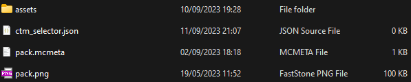

# How to use the Controls file

First thing first, create a file named controls.json in the root folder of your resource pack

> Your resource pack folder should look like this

## Controls file structure :

- Name
    - Files to toggle
