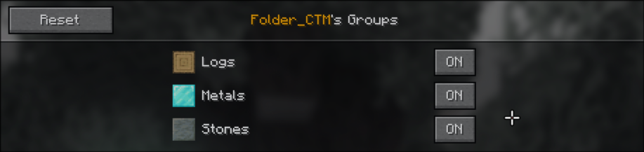

# How to create Groups for your pack

## Introduction

First thing first, create a file named `ctm_selector.json` in the root folder of your resource pack.

Its content is a list of `Groups`, which is composed as follows:

```json
[
  {
    "group_name": "Metals",
    "properties_files": [
      "minecraft:optifine/ctm/metals/"
    ],
    "icon_path": "minecraft:optifine/ctm/metals/0.png",
    "enabled": true,
    "button_tooltip": ""
  },
  {
    "group_name": "Logs",
    "properties_files": [
      "minecraft:optifine/ctm/organics/",
      "biomesoplenty:optifine/ctm/organics/"
    ],
    "icon_path": "minecraft:optifine/ctm/organics/oak/0.png",
    "enabled": true,
    "button_tooltip": ""
  },
  {
    "group_name": "Stones",
    "properties_files": [
      "minecraft:optifine/ctm/stones/"
    ],
    "icon_path": "minecraft:optifine/ctm/stones/polished_stones/25.png",
    "enabled": true,
    "button_tooltip": ""
  }
]
```

## Fields

### Group Name

The `group_name` field is the name that will be displayed in the Controls screen.

For example with the above configuration, we would have the following groups screen:



### Properties Fields

The `properties_files` field is an array of string, and each of these string is the path to
either a directory containing all the blocks you want to include in your group, or the path
to each individual `.properties` file.

Each of these must contain the namespace followed by a `:`, followed by the path to the block
from the namespace (if your textures are located in `minecraft/assets/optifine/ctm/logs/`,
you would write the following: `minecraft:optifine/ctm/logs/`)

### Icon Path

The path to the texture Identifier, it must point to a `.png` file

### Enabled (optional)

The `enabled` defines whether the group will be disabled at first, but it can be modified by
the user so this is just a default value, and it can be omitted

### Button Tooltip (optional)

The `button_tooltip` field contains the tooltip that will be rendered when hovering the ON/OFF
button in the group screen
